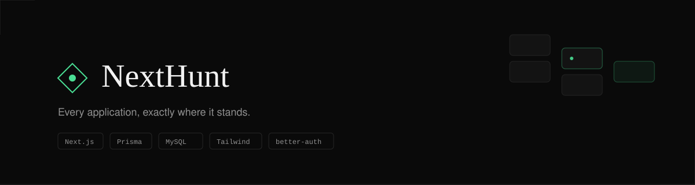
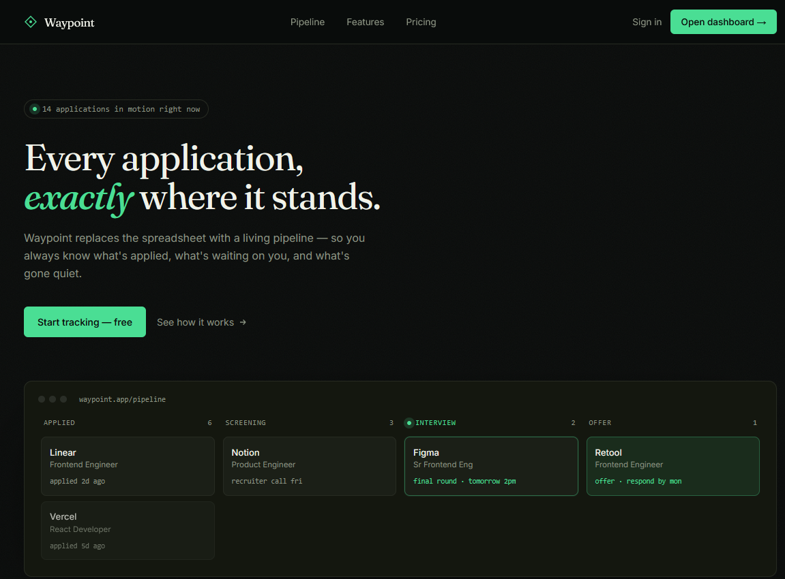
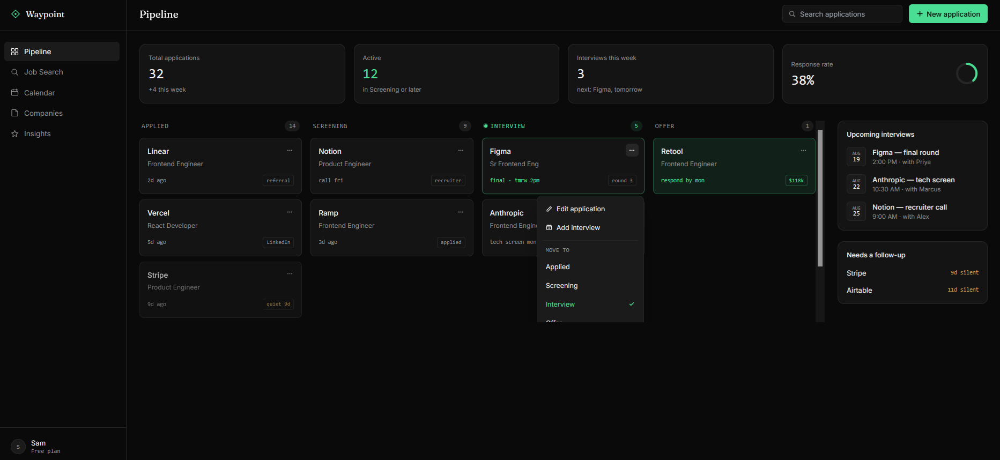
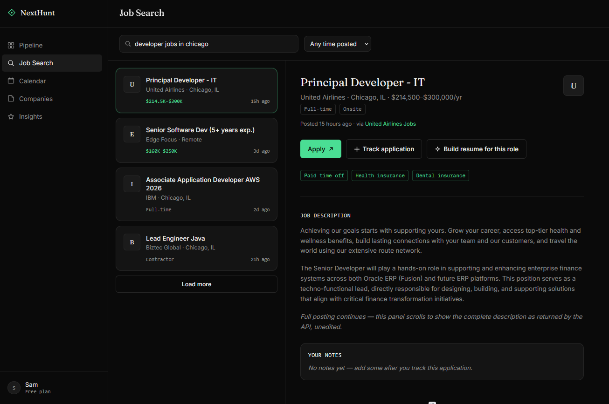
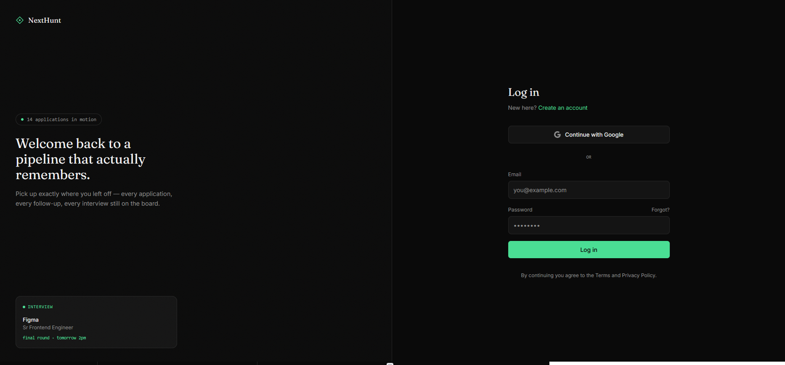
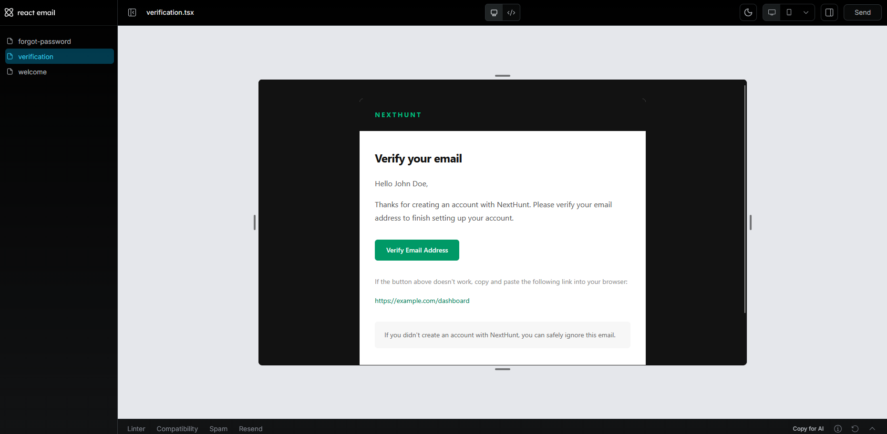

<p style="display: flex; width: 100%; justify-content: center; gap: 4px">
  <a href="https://nextjs.org" target="_blank">
    
  </a>
  <a href="https://www.typescriptlang.org" target="_blank">
    
  </a>
  <a href="https://tailwindcss.com" target="_blank">
    
  </a>
  <a href="https://resend.com" target="_blank">
    
  </a>
  <a href="https://www.better-auth.com" target="_blank">
    
  </a>
</p>

A job hunt tracker for people who are tired of losing track of applications in a spreadsheet. Every application lives on a pipeline  Applied, Screening, Interview, Offer  with interviews, notes, and follow-up reminders attached to it instead of scattered across tabs.

## Screenshots






## Features

### Pipeline
- Kanban board across Applied, Screening, Interview, and Offer stages
- Add, edit, and delete applications
- Move an application's stage from a dropdown menu on its card (no drag-and-drop dependency)
- Stale-application flagging for anything that's gone quiet
- Response-rate and basic pipeline stats

### Interviews
- Attach one or more interviews to an application (round, date/time, interviewer, notes)
- Upcoming interviews surfaced on the dashboard

### Job Search
- Search external listings via a job search API
- Save/track a listing directly into the pipeline
- Manually add a job by pasting a URL, for postings outside the search index
- Apply, Track application, and Build resume actions per listing (resume generation is a stub  not yet implemented)

### Auth & email
- Authentication via better-auth
- Transactional email (welcome, email verification, password reset) via Resend + react-email

## Tech stack

| Layer | Choice |
|---|---|
| Framework | Next.js (App Router) |
| Styling | Tailwind CSS v4 |
| UI primitives | Radix UI |
| Component variants | class-variance-authority (CVA) |
| Forms | React Hook Form + Zod |
| Server state | TanStack Query |
| Database | MySQL via Prisma |
| Auth | better-auth |
| Email | Resend + react-email |
| Icons | lucide-react |
| Component development | Storybook |
| API mocking | MSW (Mock Service Worker) |

## Getting started

### Prerequisites
- Node.js 20+
- A MySQL database
- A Resend account and API key
- A job search API key (JSearch or equivalent)

### Setup

```bash
# install dependencies
pnpm install

# copy environment variables and fill them in
cp .env.example .env
```

Required environment variables:

```
DATABASE_URL=
BETTER_AUTH_SECRET=
BETTER_AUTH_URL=
RESEND_API_KEY=
JOB_SEARCH_API_KEY=
```

```bash
# run migrations
pnpm prisma migrate dev

# start the dev server
pnpm dev
```

The app runs at `http://localhost:3000`.

## Project structure

Feature-based structure  each feature owns its own components, API calls, hooks, and server actions, rather than splitting by technical layer across the whole app.

```
src/
  app/
    auth/              Auth routes (login, signup, etc.)
    protected/          Authenticated routes (pipeline, job search, etc.)
  api/                  Route handlers
  components/
    email/               Shared building blocks for react-email templates
    error/               Error boundaries / fallback UI
    layout/              App shell (sidebar, topbar)
    ui/                  Design-system primitives (Button, Card, Modal, etc.)
      button/
      button.stories.tsx   Storybook story
  config/                App-level configuration
  features/
    application/
      component/           Application-specific UI (Board, Column, Form, Dropdown)
      api/                 Client-side API calls
      hooks/               TanStack Query hooks (useApplications, useCreateApplication, etc.)
      action/              Server actions
    auth/                 Auth-specific UI/logic
  lib/
    email/                 react-email template setup
    resend/                Resend client
    env/                   Environment variable validation
  types/
    validators/            Zod schemas
    job/                   Job search types
  testing/
    __mocks__/
      data/                 Fixture data for mocks
      handlers/             MSW request handlers
      provider/             Test provider wrapping (QueryClient, MSW, etc.)
      browser.ts            MSW browser worker setup
      server.ts             MSW node server setup (for tests)
  utils/
```

Note: `job` currently only has a `types/` entry, not a full `features/job/` slice like `application` does  worth deciding whether job search logic gets its own feature folder as it grows, to stay consistent with the pattern.

## Testing

Mock Service Worker (MSW) intercepts network requests instead of hitting a real API during development/testing  handlers live in `testing/__mocks__/handlers`, fixture data in `testing/__mocks__/data`. `browser.ts` registers the worker for the browser (dev mode), `server.ts` registers it for Node (test runs).

```bash
# start Storybook
pnpm storybook

# run tests
pnpm test
```

## Displaying and Previewing Emails
To view and test your email components in a local, interactive development dashboard, run the custom preview script. This points directly to our emails directory:
```
pnpm email:dev
```

